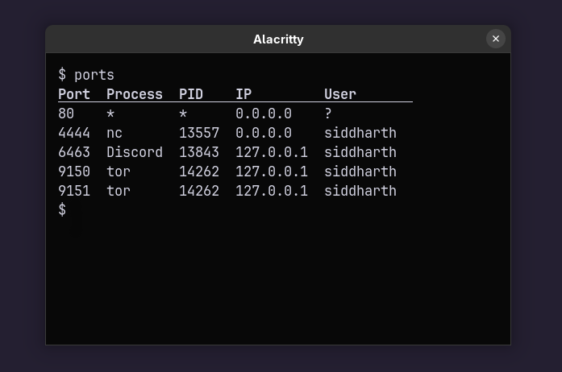

<h1 align="center"><code>ports</code></h1>
<p align="center">A wrapper around <code>ss -tunlp</code> to display cleaner output</p>
<p align="center">

</p>

## Installation

```console
$ git clone git@github.com:sdushantha/ports.git
$ cd ports
$ sudo make install
```

## Usage

To view all open ports for your current user. If the process belongs to another user, the process name and PID will be set to `*` and the username will be set to `?`.

```console
$ ports
```

To view all open ports of all users.

```
$ sudo ports
```
